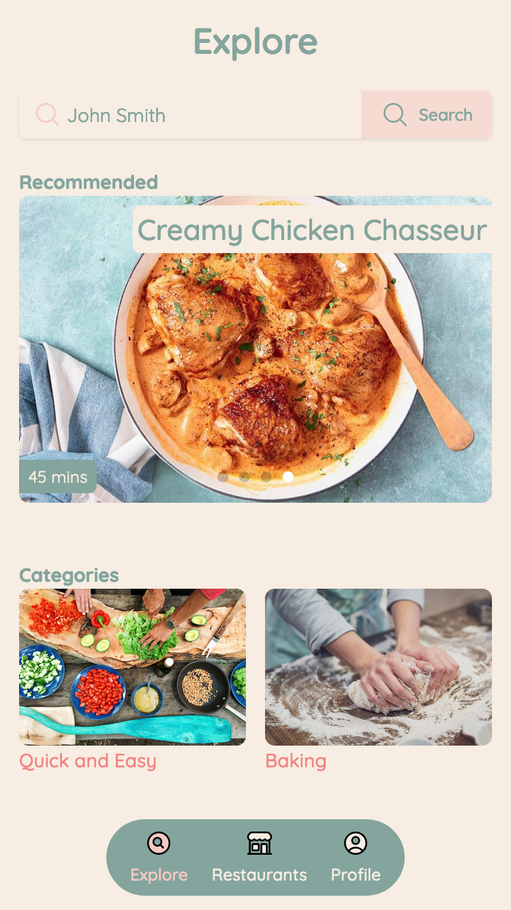
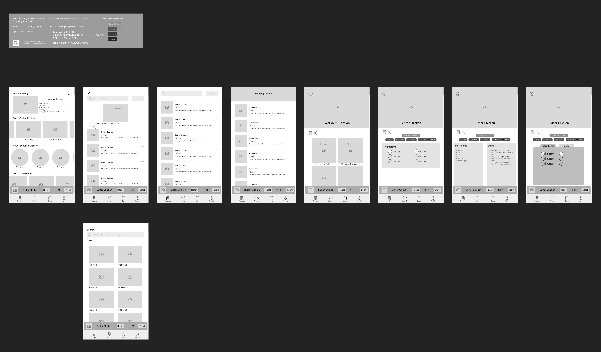

# Recipe Website

[Try it!](https://recipe-andrea.vercel.app)

Why is it called "Andrea"? Because I was trying to build an recipe website for my friend, Andrea, and I found I can modify the course project I was learning, which is a React course on Udemy. Thus, this website emeraged!

> I will be redesigning the interface and some functionality of this website.

## Current version

## Current wireframe of the new design (Figma)

Inspired by Spotify with the concept of playlists.

